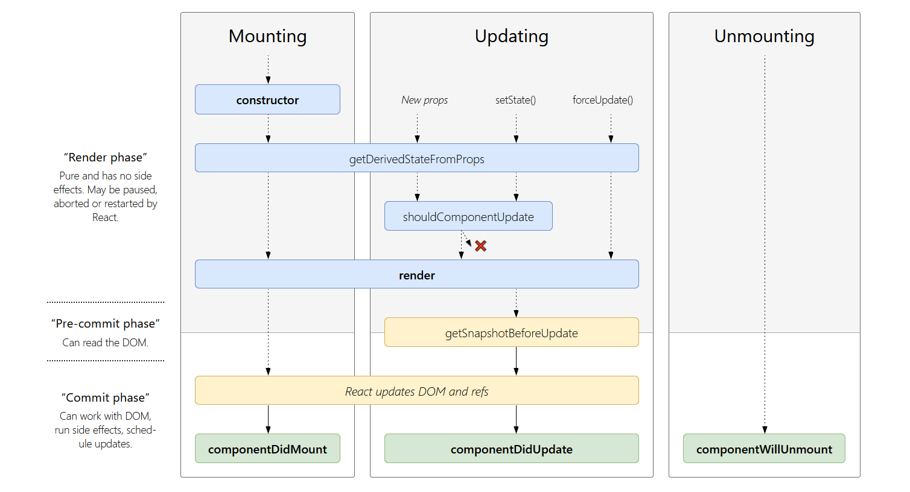

# React Notes📝

## **Composition**

### What is composition and why is it a key concept in your React apps

> In programming, composition allows you to build more complex functionality by combining small and focused functions.

In the same way we compose various small Components to build a complex one. This help us to re-use Components.

---

## Immutability

React elements are immutable. Once you create an element, you can’t change its children or attributes. An element is like a single frame in a movie: it represents the UI at a certain point in time.
`React Only Updates What’s Necessary. To update its value, you create a new variable.`
For example, you should never mutate the state property of a component directly, but onlythrough the _setState()_ method. In Redux, you never mutate the state directly, but only through reducers, which are functions.

---

## **Virtual DOM v/s DOM**

- Every time the DOM changes, the browser has to do two intensive operations: repaint & reflow.
- _Virtual DOM helpful: batching_, React batches much of the changes and performs a unique update to the real DOM, by changing all the elements that need to be changed at the same time, so browser must perform just once

---

## Components

> Components let you split the UI into independent, reusable pieces, and think about each piece in isolation.

### Function(_Stateless_) and Class(_Stateful_) Components

_Stateless/Presentational/Dumb component_:

```jsx
function Welcome(props) {
  return <h1>Hello, {props.name}</h1>;
}
```

_Stateful/Container/Smart component_:

```jsx
class Welcome extends React.Component {
  render() {
    return <h1>Hello, {this.props.name}</h1>;
  }
}
```

| **Stateless component**     | **Stateful component**           |
| --------------------------- | -------------------------------- |
| When we only need props     | Dependent on state for rendering |
| Moreover a static component | Interactive on page              |
| Light weight component      | Heavy component                  |
| Generating some markup      | Backend operations               |
| Work as leaf component      | Might handle various components  |

---

## **State & Lifecycle**

```jsx
class example extends Component{
    constructor(props){
        super(props);
        this.state = {
            s1 : "xyz",
            s2 : "abc",
            .
        };
    }
```

**OR**

```jsx
class example extends Component{
    state = {
        s1 : "xyz",
        s2 : "abc",
        .
    }
```

Whenever _setState()_ is called, React knows the state has changed, and calls the _render()_ method again to learn what should be on the screen. So, the new _this.state_ object is passed to _render()_ method will be different and React updates the DOM accordingly.

`React may batch multiple setState() calls into a single update for performance. Because this.props and this.state may be updated asynchronously, you should not rely on their values for calculating the next state.`

```jsx
setState(updater, [calback]);
```

`setState()` takes two arguments.

- An updater
  Either an _object literal_ OR _a function_.

- An optional callback
  setState() is asynchronous.
  The callback is called when the Component state has actually updated.

### **this.setState(_function_) v/s this.setState(_object_)**

- JavaScript is faster when swapping an old object reference for an entirely new object, rather than mutating anexisting object. This gives you **performance**.
- In _object literal way_ the merging is shallow, so this.setState({**STATE_1**}) leaves this.state.**OTHER** intact, but completely replaces this.state.**STATE_1**

### **Unidirectional Data Flow 🌊**

> This is commonly called a “_top-down_” or “_unidirectional_” data flow. Any state is always owned by some specific component, and any data or UI derived from that state can only affect components “_below_” them in the tree.

---

## Type checking & Default value for _props_

```npm
npm install --save prop-types
```

PropTypes is a great way to validate intended data types in our React app. Type checking our data with PropTypes helps us identify these bugs during development to ensure a smooth experience for our app's users.

By defaultProps, If any value is not required we need to specify a default value for it if it's missing when theComponent is initialized

### For Example:

```jsx
BlogPostExcerpt.propTypes = {
  title: PropTypes.string,
  description: PropTypes.string,
};
BlogPostExcerpt.defaultProps = {
  title: "",
  description: "",
};
```

---

## Handling Events

- React events are named using camelCase, rather than lowercase.
- With JSX you pass a function as the event handler, rather than a string.

> You have to be careful about the meaning of this in JSX callbacks. In JavaScript, class methods are not [bound](https://developer.mozilla.org/en/docs/Web/JavaScript/Reference/Global_objects/Function/bind) by default. If you forget to [bind](https://javascript.info/bind) this.handleClick and pass it to onClick, this will be undefined when the function is actually called.

---

## Lifecycle Event


Image from [**here!**](http://projects.wojtekmaj.pl/react-lifecycle-methods-diagram/)

[Article](https://www.freecodecamp.org/news/these-are-the-concepts-you-should-know-in-react-js-after-you-learn-the-basics-ee1d2f4b8030/)

- `componentDidMount()`

  invoked immediately after the component is inserted into the DOM

- `componentWillUnmount()`

  invoked immediately before a component is removed from the DOM

- `getDerivedStateFromProps()`

  invoked after a component is instantiated as well as when it receives brand new props

> Note:
> These methods are considered legacy and you should avoid them in new code:
>
> - [`UNSAFE_componentWillMount()`](https://reactjs.org/docs/react-component.html#unsafe_componentwillmount)
> - [`UNSAFE_componentWillUpdate()`](https://reactjs.org/docs/react-component.html#unsafe_componentwillupdate)
> - [`UNSAFE_componentWillReceiveProps()`](https://reactjs.org/docs/react-component.html#unsafe_componentwillreceiveprops)

---

# Important link

- [How to NOT React: Common Anti-Patterns and Gotchas in React](https://codeburst.io/how-to-not-react-common-anti-patterns-and-gotchas-in-react-40141fe0dcd)
- [These are the concepts you should know in React.js (after you learn the basics)](https://www.freecodecamp.org/news/these-are-the-concepts-you-should-know-in-react-js-after-you-learn-the-basics-ee1d2f4b8030/)

---

# Bibliography📚

- [React Official Docs](https://reactjs.org/docs/getting-started.html)
- [Flaviocopes](https://flaviocopes.com/page/react-handbook/)

- [Stateful vs. Stateless React Components](https://medium.com/@cgcrutch18/stateful-vs-stateless-react-components-13f647f7fc4)
